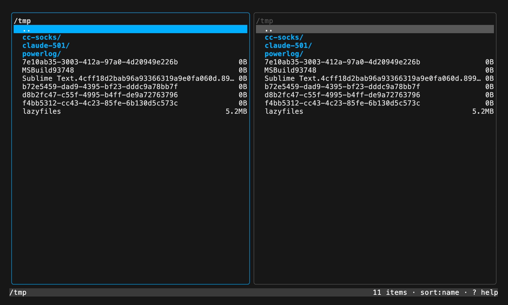

# lazyfiles

> A TUI file manager to rule them all — dual-pane, keyboard-driven, as intuitive as lazygit.

[](https://github.com/kiruva/lazyfiles/actions/workflows/ci.yml)
[](https://goreportcard.com/report/github.com/kiruva/lazyfiles)
[](LICENSE)

Built for the Linux community first, comfortable on macOS. Leans on what Total Commander is
to Windows, reimagined for the terminal.

> **Status:** early days — dual-pane navigation, recursive copy/move/delete, pack/unpack
> archives, and view/edit text (including files **inside** archives). See [ROADMAP.md](ROADMAP.md).



## Install

```sh
# With Go installed (1.24+):
go install github.com/kiruva/lazyfiles@latest

# Or build from source:
git clone https://github.com/kiruva/lazyfiles
cd lazyfiles
make build      # produces ./lazyfiles
```

Pre-built binaries for Linux and macOS (amd64/arm64) are attached to each
[release](https://github.com/kiruva/lazyfiles/releases).

## Run it

```sh
lazyfiles        # or: go run .
```

## Keys

| Key                | Action                          |
| ------------------ | ------------------------------- |
| `j` / `↓`          | Move cursor down                |
| `k` / `↑`          | Move cursor up                  |
| `PgDn` / `PgUp`    | Page down / up                  |
| `g` / `G`          | Jump to top / bottom            |
| `l` / `enter`      | Open directory                  |
| `h` / `⌫`          | Go to parent dir                |
| `Tab`              | Switch active pane              |
| `Space`            | Select / deselect entry         |
| `s`                | Cycle sort (name → size → time) |
| `.`                | Toggle hidden files             |
| `F5` / `c`         | Copy selection → other pane     |
| `F6` / `m`         | Move selection → other pane     |
| `F8` / `Del` / `d` | Delete selection                |
| `p`                | Pack selection → other pane     |
| `u`                | Unpack archive → other pane     |
| `U`                | Unpack archive in place         |
| `Enter`            | Open dir / browse into archive  |
| `v`                | View file (read-only)           |
| `e`                | Edit file (nano-style)          |
| `?`                | Show all keybindings            |
| `y` / `n`          | Confirm / cancel a prompt       |
| `q` / `Ctrl+C`     | Quit                            |

Press `?` any time for the full keybinding overlay.

Operations act on the marked selection (`Space`), or on the highlighted entry when nothing
is marked. Copy/move/pack/unpack always go from the **active** pane to the **other** pane.

Archive actions shell out to `tar`, `unzip`, `7z`, and `unrar` (only the tool for the format
you touch is required). `pack` writes a `.tar.gz`.

## View & edit

`v` opens a file in a scrollable read-only viewer; `e` opens it in a nano-style editor
(`Ctrl+S` save, `Ctrl+Q`/`Esc` quit — `Esc` guards unsaved changes). Binary files are refused.

This works **inside archives** too: press `Enter` on a `.tar`/`.tar.gz`/`.zip` to browse its
contents as a virtual folder, then `v`/`e` on any member streams it into memory. Saving an
edited member writes it back to the archive (targeted update for zip / uncompressed tar;
transparent repack for compressed tar; `.7z`/`.rar` browsing requires unpacking).

**Copying into archives**: with one pane browsing inside an archive and the other on real
files, `F5`/`c` (copy) or `F6`/`m` (move) adds the selected files/folders as members at the
archive's current virtual directory. `pack`/`unpack` still require a real destination pane.

## Development

```sh
make run     # go run .
make test    # go test ./...
make vet     # go vet ./...
make lint    # golangci-lint run
make build   # build ./lazyfiles
```

See [CONTRIBUTING.md](CONTRIBUTING.md) for the project layout and guidelines.

To regenerate the demo GIF, install [VHS](https://github.com/charmbracelet/vhs) and run
`vhs demo.tape`.

## Built with

[Bubble Tea](https://github.com/charmbracelet/bubbletea) ·
[Lip Gloss](https://github.com/charmbracelet/lipgloss) ·
[Bubbles](https://github.com/charmbracelet/bubbles)

## License

[MIT](LICENSE)
